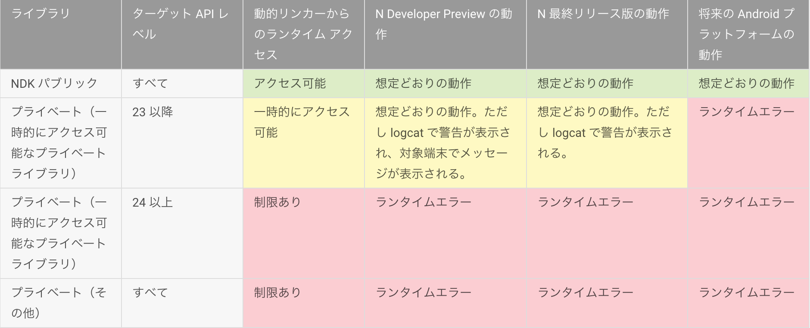

### firebase, Nugat, kotlin

#### 目的
* 各項目について理解する。

#### ゴール
* 各項目について説明できる。

---
### firebase
#### firebaseとは
* データストレージ、ユーザー管理などアプリケーションのバックエンドとして必要となる機能をサービスを提供することで、アプリケーション開発者がクライアントサイドの開発に集中できるようにしてくれるMBaaS（Mobile Backend as a Service）の一種
* 2014年にGoogleが買収
* 参考
  * https://html5experts.jp/technohippy/18040/

#### 特徴
* Analytics
  * Analyticsはその名の通り分析基盤です。これは従来のGoogle Analyticsを置き換えるもので，データのダウンサンプリング（間引き）や送信イベント数制限等も一切なく，無制限に使えるにもかかわらず完全無料です。新しいFirebaseではこのAnalyticsを中核技術と位置付けており，さまざまなプロダクトに横軸を通して連携できるようになっています。
  * ユーザ層やアプリの使用頻度，滞在時間やひとりあたりの売上など，これまで複数の分析サービスを組み合わせていたようなことが1ヵ所でできるようになります。また，ユーザをセグメントに分けて特定の層にだけプッシュ通知を送ったり，Google BigQueryと連動して詳細な解析をすることなども可能です。
* Develop
  * Developは開発支援に特化したフィーチャーで，以下のようなプロダクト群を内包しています。
    * Cloud Messaging
      * Firebae Cloud Messagingはクロスプラットフォームなメッセージ配信基盤
    * Authentication
      * 従来あった認証基盤
    * Realtime Database
      * 従来あったリアルタイムデータベース
    * Storage
      * Google Cloud Storageと連動して簡単かつ安全にファイルのアップロードをすることができるようになりました。
    * Hosting
      * 従来あった静的Webサイトホスティング
    * Remote Config
      * Remote Configはアプリを再リリースすることなくコンテンツの一部を差し替えたり，簡単にA/Bテストを実施することができる非常に強力な新機能です。
      * プラットフォームや国ごとにコンテンツを出し分けたり，数字やフラグを切り替えたりすることも容易です。
    * Test Lab
      * Googleのデータセンター上に置かれている膨大な実機を使ったテストをネットワーク越しに行うことができるサービスです。
      * Android Studioから直接実行する機能も提供されています。
    * Crash Reporting
      * アプリのクラッシュレポート機能です。
      * クラッシュを検知するだけでなく，AnalyticsやNotificationと連携してクラッシュしたユーザにだけアップデートを促したりするようなことも可能です。
* Grow
  * アプリの成長フェーズを支援するプロダクト群を内包しています。
    * Notifications
      * プッシュ通知を簡単に送ることができるWebコンソールです。
      * 1行もコードを書かなくても管理画面からプッシュ通知を送れるほか，AnalyticsやCrash Reportingと連携して特定のユーザにだけ通知を送ることもできます。
    * App Indexing
      * 既存のApp IndexingがFirebaseプロダクト群に取り込まれました。
      * Google検索結果にアプリの情報を表示し，ユーザに回遊を促すことができます。
    * Dynamic Links
      * より進化したディープリンクです。
      * 1つのリンクでiOSとAndroidなどプラットフォームごとに適切な場所に誘導したり，リンクに対応するアプリをインストールしているか否かで挙動を変えたりすることができます。
    * Invites
      * 紹介コードやクーポンをディープリンクを使ってSMSやEメール越しに簡単にシェアすることができる機能を提供します。
      * 前述のDynamics Linksが利用されており，アプリが入っていなくてもユーザはクリックするだけで簡単にアプリをインストールしてクーポンの適用まで離脱することなく行うことができます。
    * AdWords
      * 既存のGoogle AdWordsがFirebaseプロダクト群に取り込まれました。
      * アプリの宣伝を適切なユーザに簡単に行うことができます。
* Earn
  * アプリの収益化フェーズを支援するフィーチャーです。
    * AdMob
    * 既存のGoogle AdMobがFirebaseプロダクト群に取り込まれました。
    * AdMobが提供するさまざまな種類の広告商品とアドネットワークを使ってアプリの収益化を助けます。
* リアルタイムデータベース
  * 誰かが更新すると自動で他の端末にも更新される
  * オフライン動作も可能
  * FirebaseのデータベースはスキーマレスないわゆるNoSQLで、特定のアプリケーションに関係するデータ全体がひとつのJSONオブジェクトとして保持される
* 認証機能
  * ほとんどのアプリでは、ユーザー ID を識別する必要があります。アプリでユーザー ID を識別することにより、ユーザーデータをクラウドに安全に保存したり、ユーザーのすべての端末で、カスタマイズされた同じ体験を提供したりできるようになります。
  * Firebase Authentication には、バックエンド サービス、使いやすい SDK、アプリでのユーザー認証に使用できる UI ライブラリが用意されています。Firebase Authentication では、パスワード、電話番号、一般的なフェデレーション ID プロバイダ（Google、Facebook、Twitter）などを使用した認証を行うことができます。

|認証の種類|概要|
|:--|:--|
|大手SNS認証|	Facebook, GitHub, Google, Twitter アカウントを使った認証|
|パスワード認証|	Firebase自身にEメール，パスワードを登録し，それを使った認証|
|匿名ログイン|	一時的な匿名ログイン|
|カスタムログイントークン|	すでに自前で持っている認証基盤との連携|
* 静的Webサイトホスティング
  * SSL対応した静的Webサイトを簡単に公開できるホスティングサービス

---
### Android7.0 Nugat
https://developer.android.com/about/versions/nougat/android-7.0-changes.html#ndk
#### 変更点
* 電池とメモリ
  * 端末の電池寿命を改善したり、RAM の使用量を削減したりするために、システムの動作がいくつか変更されています。これらの変更は、システム リソースへのアプリのアクセスに加え、特定の暗黙的インテントを介して他のアプリとやり取りする方法に影響を及ぼす可能性があります。
  * Doze
    * Dozeとは、Android6.0で導入され、ユーザーが端末を電源と接続せずに静止状態にし、画面をオフにすると、CPU とネットワークのアクティビティを保留して電池の寿命を改善するものです。
    * 変更点は、端末を電源と接続せずに画面をオフにすると、端末が静止していなくても（たとえば、ユーザーがハンドセットをポケットに入れて持ち歩いている場合）、CPU およびネットワーク制限のサブセットがアプリに適用されることです。
  * バックグラウンド処理の最適化
    * メモリ使用量と消費電力を最適化するために、3 つの暗黙的なブロードキャストが削除されています。
      * 暗黙的なブロードキャストが行われると、バックグラウンドでブロードキャストをリッスンするように登録されているアプリが頻繁に起動されるため
    * これらのブロードキャストを削除すると端末のパフォーマンスとユーザー エクスペリエンスが大幅に向上します
* パーミッションの変更
  * アプリに影響を及ぼす可能性のあるパーミッションが変更
  * ファイルシステムのパーミッション
    * プライベート ファイルのセキュリティを強化するために、Android 7.0 以降向けのアプリのプライベート ディレクトリにはアクセス制限があります。
    * この設定により、サイズや存在など、プライベート ファイルのメタデータの漏洩を防ぐことができます。
* アプリ間のファイルの共有
  * Android 7.0 向けのアプリでは、Android フレームワークにより、自身のアプリ外への file:// URI の公開を禁止する StrictMode API ポリシーが適用されます。
  * ファイル URI を含むインテントがアプリからなくなると、FileUriExposedException 例外によりアプリはエラーになります。
  * アプリ間でファイルを共有するには、content:// URI を送信して、この URI への一時的なアクセス パーミッションを付与する必要があります。
* ユーザ補助機能の改善
  * 低視力のユーザーまたは視覚障害のあるユーザー向けのプラットフォームのユーザビリティを改善するための変更
  * 追加機能
    * 画面ズーム
    * セットアップ ウィザードの [Vision Settings]
* プラットフォーム ライブラリにリンクした NDK アプリ
  * Android 7.0 以降、NDK 以外のライブラリを動的にリンクできなくなります。その結果、アプリがクラッシュする可能性があります。
    * この動作の変更は、プラットフォームが更新されたり、さまざまな端末で使用したときでもアプリの操作感に一貫性を持たせるためです。
    * 自作のコードでプライベート ライブラリにリンクしていなくても、アプリ内のサードパーティの静的ライブラリで NDK 以外のライブラリにリンクしている可能性があります。
  * アプリでプライベート プラットフォーム API にアクセスを試みるケース
    * アプリで直接プライベート プラットフォーム ライブラリにアクセスしている。
      * 目的のライブラリをコピーして含めるか、パブリック NDK API を使用するようにアプリを更新する必要があります。
    * アプリで、プライベート プラットフォーム ライブラリにアクセスするサードパーティ ライブラリを使用している。
      * プライベート ライブラリに直接アクセスしていないという確信があっても、この状況を想定してアプリをテストする必要があります。
    * APK に含まれていないライブラリをアプリが参照している。
      * たとえば、OpenSSL を独自にコピーして使用するつもりで、このライブラリをアプリの APK にバンドルするのを忘れていた場合などが考えられます。このようなアプリは、libcrypto.so が含まれているバージョンの Android プラットフォームでは問題なく実行できる可能性があります。ただし、このライブラリが含まれていないそれ以降のバージョンの Android（たとえば Android 6.0 以降）では、アプリがクラッシュする可能性があります。この問題を修正するには、NDK 以外のすべてのライブラリを APK にバンドルしてください。

  * 
* Android for work
  * Android 7.0 には、証明書のインストール、パスワードの再設定、セカンダリ ユーザーの管理、端末識別子へのアクセスなど、Android for Work をターゲットにしているアプリに対する変更が含まれています。

* アノテーションの保持
  * Android 7.0 では、アノテーションの表示が無視されていたバグが修正されました。この問題によって、ランタイムがこれまでできなかったアノテーションへのアクセスが可能になっていました。
  * 対象となるアノテーション
    * VISIBILITY_BUILD:ビルド時にのみ表示されます。
    * VISIBILITY_SYSTEM:実行時に表示されますが、基幹システムにのみ表示されます。

---
### kotlin
* Scalaなどと同様にJava仮想マシン（JVM）言語になるJetBrainsが作った開発言語である。 言い換えれば、Kotlinをコンパイルすると、JVM上で動作するバイトコードを生成してくれる。
* 型推論やラムダ式，トレイトなどのモダンな文法，機能を持った静的型付けの本格的なオブジェクト指向言語
* Javaと100%互換
  * 現在のAndroid APIをそのまま使用でき、すべてのJavaフレームワークを使うことができる。
  * AntやMaven、Gradleのようなビルドシステムを使用することができる。
##### 特徴
* コードが簡潔
* null安全
